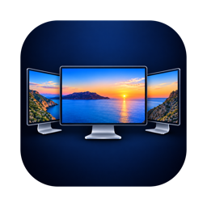
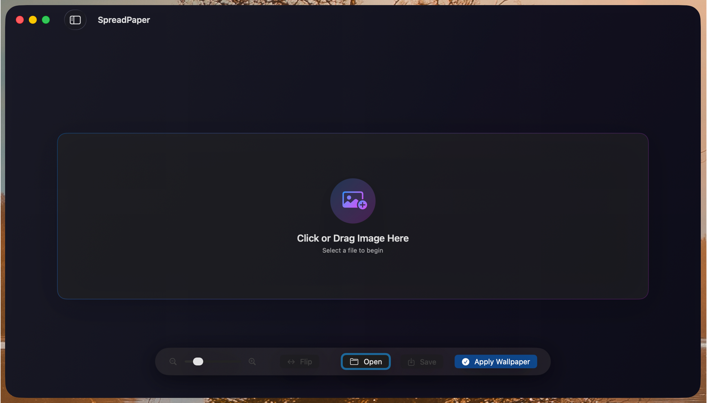
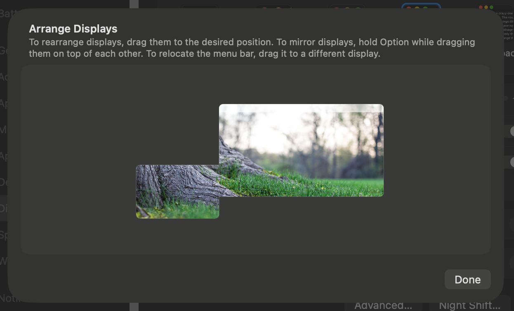
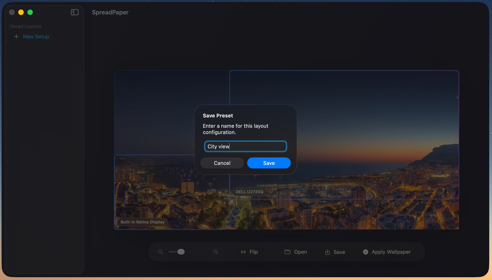

<div align="center">
  

  # SpreadPaper

  ### Spread one high-resolution wallpaper across multiple monitors

  [](LICENSE)
  [](https://www.apple.com/macos/sequoia/)
  [](https://github.com/spreadpaper/SpreadPaper/releases/latest)

  **Free • Open Source • Native macOS App**
</div>

---

## What is SpreadPaper?

SpreadPaper is a native macOS utility that lets you use a single high-resolution image as a wallpaper that seamlessly spans across all your connected monitors. No more dealing with separate wallpapers for each display or awkward cropping – just drag, position, and apply. One image gives you a static wallpaper, two give you a Light & Dark pair, and a set of images becomes a schedule that shifts through the day on every screen at once.

Perfect for:
- **Multi-monitor setups** with 2, 3, or more displays
- **Ultra-wide panoramic images** that deserve to be displayed in their full glory
- **Creative professionals** who want a cohesive desktop aesthetic
- **Anyone** tired of macOS's limited multi-monitor wallpaper options

## Screenshots

<div align="center">
  
  <p><em>Intuitive drag-and-drop interface with live preview of your wallpaper across all displays</em></p>
</div>

<div align="center">
  
  <p><em>Seamlessly spread a single wallpaper across two monitors</em></p>
</div>

<div align="center">
  
  <p><em>Scale up to three or more displays with perfect continuity</em></p>
</div>

<div align="center">
  
  <p><em>Automatically syncs with your macOS display arrangement for accurate positioning</em></p>
</div>

<div align="center">
  
  <p><em>Save your favorite configurations as presets for quick switching</em></p>
</div>

## Features

**Three kinds of wallpaper**

🖼️ **Static** – One image, stretched seamlessly across every display

🌓 **Light & Dark** – A light image and a dark one, switched by the macOS appearance

🕑 **Dynamic** – Up to 16 images on a time-of-day schedule, in sync on every screen

**In the editor**

✨ **Visual positioning** – Drag your image around a live canvas that mirrors your display arrangement

🔄 **Zoom, fit and flip** – Get the crop right from the floating HUD over the bottom of the canvas

📥 **Drag and drop** – Drop images onto the canvas or onto the first-run wizard

📏 **Bezel compensation** – With two or more displays, set each monitor's frame width so the image lines up across the gaps

🎯 **Preview** – Put the wallpaper on your screens before you commit to saving it

**Your library**

💾 **Presets** – Save a configuration and reapply it from the gallery in one click

🔍 **Filter and search** – Narrow the gallery by type or by name

🗂️ **Duplicate, rename, show in Finder** – Manage presets from the card menu

🧭 **First-run wizard** – Detects your displays and gets you to an image in two steps

⬇️ **Update checking** – Settings shows new releases with DMG and ZIP download links

## 📥 Download & Installation

**[Download the latest version](https://github.com/spreadpaper/SpreadPaper/releases/latest)**

Because SpreadPaper is a free, open-source project and not signed with a paid Apple Developer ID ($99/year), macOS Gatekeeper will flag it on the first launch. **This is normal behavior for FOSS apps.**

1. **Download** the `SpreadPaper.dmg` (or `.zip`) from the Releases page.
2. **Open** the DMG and drag **SpreadPaper** to your **Applications** folder.
3. **Remove the quarantine flag** by running this command in Terminal:
   ```bash
   xattr -dr com.apple.quarantine /Applications/SpreadPaper.app
   ```
4. **Launch SpreadPaper** normally.

*You only need to do this once. Future launches will work normally.*

## How to Use

1. **First launch** opens a wizard that counts your displays. Drop images on it or browse to pick them, and it takes you straight to the editor.
2. **Later launches** open the gallery. Click **New Wallpaper** (⌘N) and pick Static, Light & Dark or Dynamic.
3. **Position your image** by dragging it on the canvas, and zoom, fit or flip it from the HUD floating over the bottom of the canvas.
4. **Set the times** on a Dynamic wallpaper by clicking a schedule row in the inspector and dragging the start time on the bar.
5. **Click "Save & Apply"**, name the preset, and it goes up on every monitor.

## Show off your setup

Got SpreadPaper running across your monitors? Post a photo of your desk in the [Show and tell](https://github.com/spreadpaper/SpreadPaper/discussions/categories/show-and-tell) discussions. Real photo, not a screenshot, so everyone can see how the image crosses the frames. Add the wallpaper if you can share it, and mention anything you tweaked to get it lined up.

[Create a Show and tell post](https://github.com/spreadpaper/SpreadPaper/discussions/new?category=show-and-tell)

With your permission, a few setups will be featured on the SpreadPaper website, credited by GitHub handle.

## Requirements

- macOS 15.0 (Sequoia) or later
- Apple Silicon Mac
- Multiple monitors (recommended, but works with single displays too)

> **Note:** This project is compiled for and tested on macOS Sequoia (15.0+) with Apple Silicon. If you are using an older macOS version or Intel Mac and would like support, please [open a feature request](https://github.com/spreadpaper/SpreadPaper/issues).

## Building from Source

```bash
# Clone the repository
git clone https://github.com/spreadpaper/SpreadPaper.git
cd SpreadPaper

# Open in Xcode
open SpreadPaper.xcodeproj

# Build and run (⌘R)
```

## Contributing

Contributions are welcome! Feel free to:
- [Download the latest release](https://github.com/spreadpaper/SpreadPaper/releases/latest)
- [Report bugs](https://github.com/spreadpaper/SpreadPaper/issues)
- [Request features](https://github.com/spreadpaper/SpreadPaper/issues)
- [Share your setup](https://github.com/spreadpaper/SpreadPaper/discussions/new?category=show-and-tell)
- Submit pull requests

## License

SpreadPaper is free and open source software licensed under the [MIT License](LICENSE).
